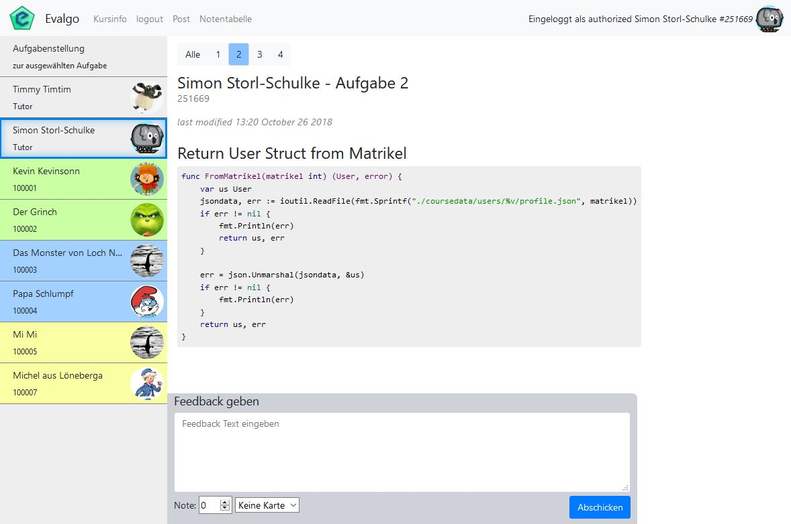

# Evago - Evaluierung von Go für Webdevelopment

### Veranstaltung: Aktuelle Entwicklungen im Bereich Online Medien - Prof. Eisenbiegler

## Beispielhafte Ordnerstruktur:

- 🗀 Hauptverzeichniss
    - **Executable** (Evalgo.exe / Evalgo linux binary)
    - 🗀 templates
    - 🗀 static
        - 🗀 css
        - 🗀 js
        - 🗀 highlightJS
        - 🗀 bootstrap
        - icon.png
    - 🗀 coursedata
        - courseconfig.json
        - info.md
        - 🗀 tasks
            - 🗀 img (beliebige Unterstruktur)
                - 🗀 unterordner1
                    - bild.png
                - coolesBild01.png
            - post_001.md
            - post_002.md
            - post_...
        - 🗀 ressources (beliebiger inhalt)
        - 🗀 portraits
            * ...[Matrikelnumer].png
            * default.png
        - 🗀 users
            - ...🗀 [Matrikelnummer]
                - profile.json
                - post_[postnumber].md
                - post_001.md
                - post_001_feedback.json
                - post_002.md
                - post_...

## 1. Der /coursedata Ordner
### 1.1 courseconfig.json
Im /coursedata Ordner der Anwendung muss eine Datei `courseconfig.json` liegen. Der Inhalt sieht folgendermaßen aus:
```json
{
    "port": ":8080",
    "course_name": "Evalgo",
    "group_number": 4,
    "open_course": false,
    "root_url": "/evalgo/",
    "master_password": "gulasch",
    "tutors_can_post": true,
    "enable_grades": true,
    "enable_cards": true,
    "classes":[ "MIB", "MKB", "OMB" ]
}
```
- `port` bestimmt den Port auf dem Server, auf dem die Anwendung laufen soll.
- `course_name` bestimmt den Titel des Kurses, der auf der Hauptseite angezeigt wird.
- `group_number` bestimmt die Anzahl der Gruppen (Farben), in die die Kursteilnehmer unterteilt werden.
- `open_course` bestimmt, ob auch Studenten die Beiträge ihrer Mitstudierenden sehen können, oder nur Tutoren und Admins.
- `root_url` bestimmt die URL der Haupseite. Hierbei ist zu beachten, dass die Schrägstriche vorne und hinten benötigt werden.
- `tutors_can_post` Ermöglicht es Tutoren auch Abgaben zu machen oder nicht.
- `enable_grades` Schaltet beim Feedback die Notenvergabe frei
- `enable_cards` Schaltet beim Feedback die vergabe von gelben / roten Karten frei.

Die Variablen `master_password`, und `classes` sind noch ungenutzt und dienen als Platzhalter für zukünftige Versionen. Die Anwendung muss neu gestartet werden, damit Änderungen an der Konfigurationsdatei berücksichtigt werden.

### 1.2 info.md
Im /coursedata Ordner der Anwendung muss eine Datei `info.md` liegen. Diese wird beim Klick auf *Kursinfo* angezeigt und kann generelle Informationen über den Kurs beinhalten.

### 1.3 tasks/
Für die Aufgabenstellung werden Markdown Dateien in `coursedata/tasks` erstellt. Diese müssen dem Benennungsschema `post_001.md`, `post_002.md`... folgen. Der Aufgabenwähler auf der Hauptseite erkennt automatisch, für welche Aufgaben Einträge bestehen und zeigt diese im Aufgabenwähler an.


Da **Bilder** in den Aufgabenstellungen und Kursinfo von der Haupseite aus aufgerufen werden, können diese per Markdown folgendermaßen z.b. aufgerufen werden: ``. Alle in `coursedata/tasks/img` Ordner vorhandenen Bilder sond so abrufbar - auch mit beliebigen Unterordnern.


Da der tasks/img Ordner beliebig unterteilt werden kann, ist z.b. auch `` möglich - wenn das Bild in einem Unterordner tasks/img/a1 abgelegt wurde.

### 1.4 ressources/
Zusätzliche Ressourcen können im Ordner `coursedata/ressources` abgelegt werden. Diese können dann in der Aufgabenstellung mit `res/dateiname.dateiendung` und der üblichen Markdown Syntax verlinkt werden. Zum Beispiel `[Modell - Burg](res/burg.blend)`. Zudem sind diese Dateien auf der Hauptseite über den Reiter *Ressourcen* erreichbar (TODO) (wird nur angezeigt, wenn der `res` Ordner nicht leer ist).


### 1.5 users/
In diesem Ordner werden alle Profile, Abgaben und Feedbacks der registrierten Nutzer angelegt. Manuell muss hier nichts angelegt werden. wenn nicht vorhanden, wird der Ordner bei der ersten Registrierung erstellt.

**1.5.1 Nutzergruppen**
Es gibt drei Nutzergruppen:

- 1 `Student`
- 2 `Tutor`
- 3 `Admin`

Momentan werden alle Nutzer als `Student` registriert. In der entsprechenden profile.json Datei (in `coursedata/users/[matrikel]`) kann "usertype" im Nachhinein auf 2 (`Tutor`) oder 3 (`Admin`) gesetzt werden. Momentan gibt es in der Funktionalität noch keinen Unterschied zwischen Tutor und Admin.

### 1.6 portraits/
Hier werden die hochgeladenen Portraits der Nutzer gespeichert (mit Matrikelnummer als Dateiname)

## 2. Bedienung


**Registrierung und Login** sollten selbsterklärend sein. Anstelle eines Nutzernamens, wird hier die Matrikelnummer zum Login verwendet.

### 2.1 Posts
Über den Reiter "Post" können Studierende Abgaben machen. Dabei wird automatisch immer die Aufgabe ausgewählt, die auf der Hauptseite ausgewählt wurde. Über das Eingabefeld *Aufgabe Nr.* kann die Nummer im Nachhinein geändert werden. Auch hier können Texte mit Markdown formatiert werden. ***Bestehende Aufgabe editieren*** lädt fals vorhanden die bisherige Abgabe zur entsprechenden Aufgabe in das Textfeld.

### 2.2 Feedback
Je nach ausgewählter Abgabe, können Tutoren und Admins Feedback in Textform - und je nach Konfiguration auch mit Noten und roten / gelben Karten geben.

### 2.3 Portrait ändern
Mit einem Klick auf das Profilfoto rechts oben, kann das Portrait geändert werden.

### PDF Download
**[wkhtmltopdf](https://wkhtmltopdf.org/) muss für die PDF Funktionalität installiert und zu PATH hinzugefügt sein.**
Dann kann über die URL `.../[Matrikelnummer]/pdf` eine PDF Datei mit allen Abgaben des in der URL mit der Matrikelnummer bestimmten Studenten erstellen. Download dieser Dateien ist momentan noch nicht möglich.

## 3. Abhängigkeiten
Zum Kompilieren der Anwendung mit Go, werden zusätzlich folgende Packages benötigt:

[github.com/russross/blackfriday](github.com/russross/blackfriday)

[github.com/gorilla/mux](github.com/gorilla/mux)

[github.com/SebastiaanKlippert/go-wkhtmltopdf](github.com/SebastiaanKlippert/go-wkhtmltopdf)