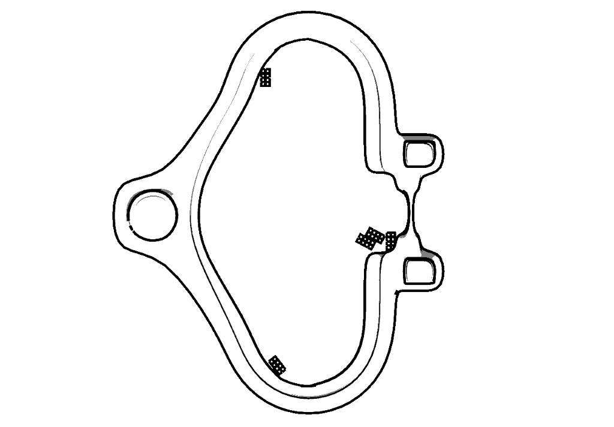
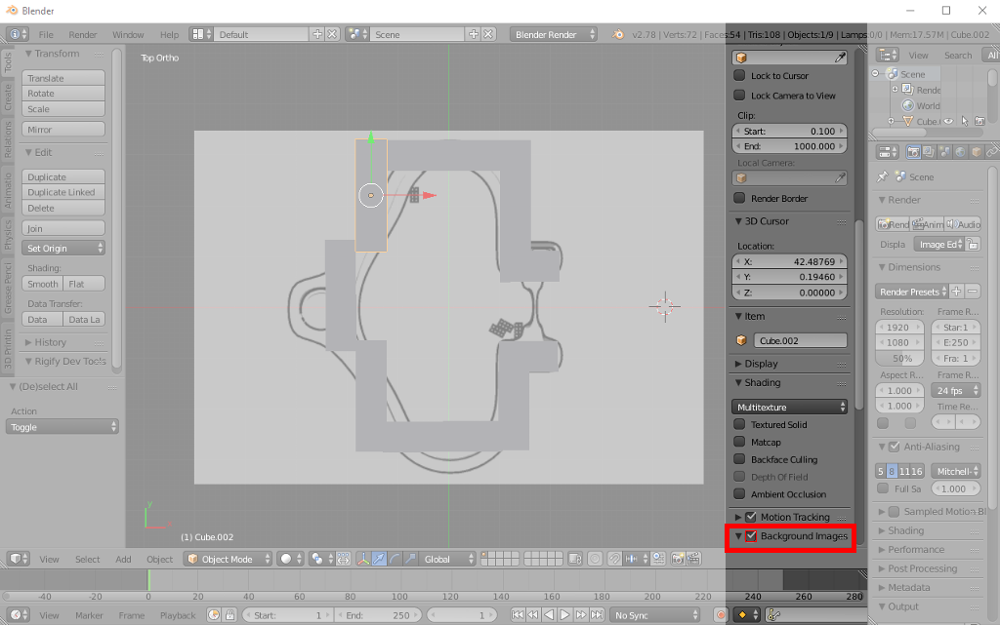
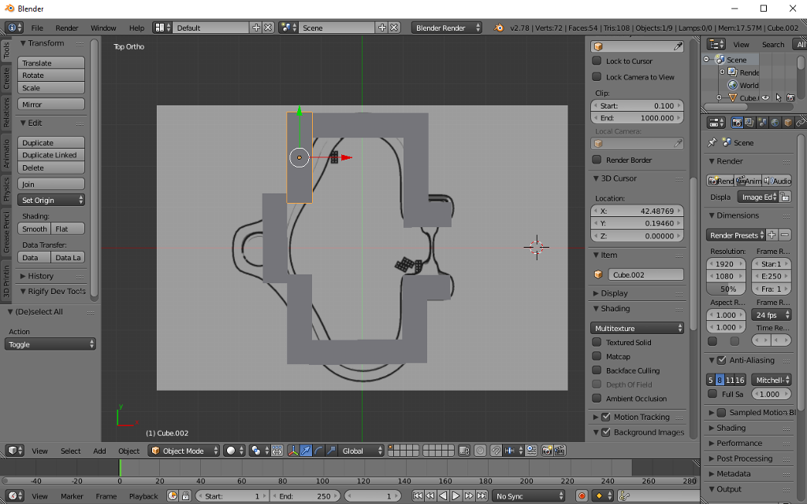
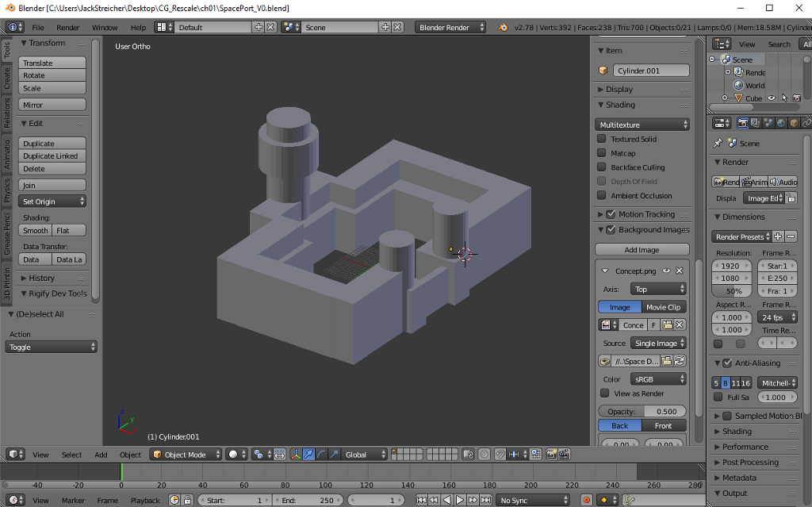
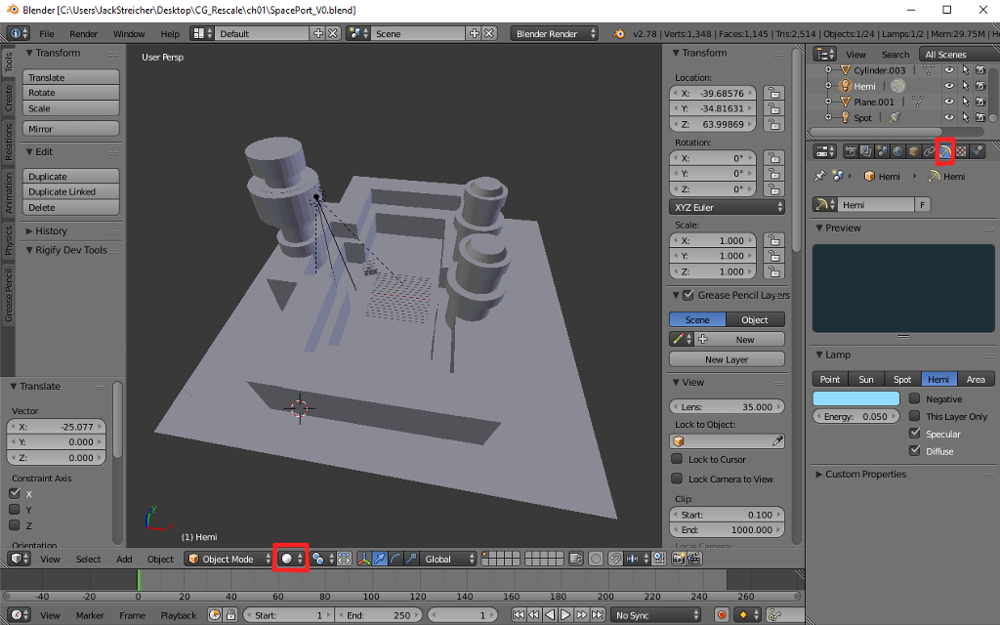
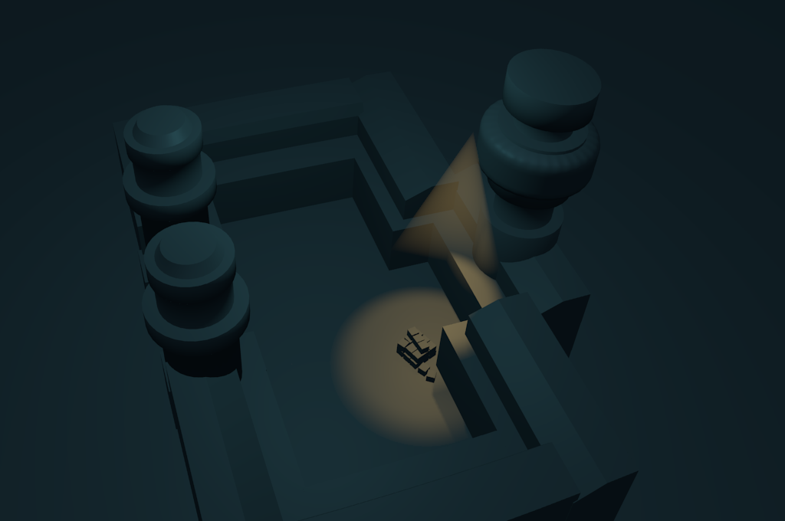

## Arbeiten mit Primitiven
**Das folgende Kapitel beschäftigt sich mit der Erstellung eines Weltraumhafens Die Übung soll den Umgang mit primitiven Objekten (Würfeln, Kegeln etc.) und Lichtern erklären.**

## 1. Vorbereitung

**Für Laptopnutzer: Sollte Blender bei euch ruckeln und eine sehr schlechte Performance erzielen, solltet ihr mit einem Rechtsklick auf die Blender.exe eure Onboard-Grafikkarte auswählen. Eine Maus wird des weiteren benötigt, um den Tutorials folgen zu können**

* Startet Blender. Im neuen Projekt drückt ihr `A`, um alles zu Markieren und anschließend `X` gefolgt von einem klick auf "Delete" um eure Szene komplett zu bereinigen.

* Benutzt entweder das obere Konzept oder erzeugt euer eigenes. *Seid euch, um Zeit zu sparen immer im Vorfeld darüber klar, was ihr modellieren wollt. Erstellt Konzepte und Skizzen, die euch als Vorlage dienen.*
* Drückt `Num 7` um auf die "Top-View" zu wechseln. Anschließend wechselt ihr mit `Num 5` in die Orthogonale Ansicht.

## 2. Background Image

* Eure Vorlage soll euch immer im Sichtfeld sein. Aktiviert "Background Image" indem ihr auf das leere Feld daneben klickt.

* Klappt den Reiter "Background Image" auf und klickt auf "Add Image".

* Eine neue Schaltfläche erscheint, wählt bei dieser unter "Axis" "Top", damit ihr eure Vorlage nur von oben sehen könnt

**Background Images sind nur in der Orthogonalen Ansicht Sichtbar (`Num 5`)**

* Wählt nun "Open" und sucht eure Skizze heraus. Weitere Felder werden erscheinen. Fahrt mit der Maus über die jeweiligen Flächen um zu erfahren, was sie bewirken.

[Videotutorial zum Einrichten eines Background-Image](https://youtu.be/ZtSh4Yedafg?t=361)

## 3. Mauern

* Fügt mit `Shift A` gefolgt von einem Klick auf "Mesh" einen Würfel ein.

* Wählt den Würfel mit einem Rechtklick aus. Über die Taste `S` könnt ihr den Würfel skalieren. Drückt ihr `S` gefolgt von `X`, `Y` oder `Z` skaliert ihr entlang der jeweiligen Achse.

* Mit der Taste `G` gefolgt von `X`, `Y` oder `Z` lassen sich Objekte verschieben.

* Achsen können von Transformationen ausgeschlossen werden, indem man während der Operation `Shift` gefolgt von der zu ignorierenden Achse wählt. Ihr könnt also einen Würfel in X- und Y-Richtung bewegen, wenn ihr `G` gefolgt von `Shift` und `Z` drückt.

* Durch `R` gefolgt von einer der Achsen rotiert ihr um die Entsprechende Achse. Wenn ihr `R` gefolgt von einer Achse wie z.B. `Z` und anschließend `Num 90` tippt, rotiert ihr um 90 Grad.

* Fügt nun einige Würfel ein und skaliert sie zuvor dünner. Baut mit ihnen grob die Umrisse eurer Mauern nach. Ihr könnt Objekte duplizieren, indem ihr `Shift+D` verwendet.

* Sobald eure Mauern stehen wechselt ihr in die Seitenansicht mit `Num 3` oder `Alt+Num 3`. In andere Ansichten kann über die Tasten `Num 1/2/3/7` oder `Alt+Num 1/2/3/7` gewechselt werden.

**Arbeitet so oft wie möglich in den vorgegebenen Ansichten, da dies die Übersicht erleichtert und den Workflow verbessert!**

* Nun könnt ihr eure Würfel auch in der Höhe skalieren. Mehrfach Auswahl von Objekten wird über `Shift+RMB` auf die auszuwählenden Objekte bewerkstelligt.

## 4. Türme

* Zurück auf die "Top-View" `Num 7`.

* Fügt jetzt mit `Shift+A` einen Cylinder ein. Skaliert den Zylinder, bis ihr mit der Größe zurfrieden seid. Platziert den Zylinder an der entsprechenden Stelle und dupliziert ihn, wenn nötig.

* Wechselt wieder in die Seitenansicht und passt seine Höhe an.

* Fügt nun weitere Grundkörper ein um eurem Raumhafen mehr Charakter zu verleihen. Beispiel: Kisten die in der Ecke stehen, Treibstofftanks, Turmspitzen, ein Tor, einen Boden etc.

## 5. Licht

* Fügt mit Hilfe von `Shift+A` ein Licht ein. Wählt euer Licht mit `RMB` aus und wechselt zu den Lichtoptionen, direkt unter eurer Szenen-Hierarchy. Hier könnt ihr Lichtstärke, Farbe uvm. einstellen.

* Fügt ein "Hemi-Licht" ein, damit nicht nur der ausgeleuchtete Teil der Szene Licht erhält - achtet darauf, das das Hemi-Licht von oben auf die Szene gerichtet ist bzw. es richtig Rotiert ist.

* Ihr könnt nun bei der Darstellung anstatt "Solid" "Rendered" auswählen um eure Lichtsetzung zu bewundern. *Vorsicht, schwächere Pcs könnten beim wechsel in Rendered in die Knie gehen.*

## Aufgabe
* Verfeinert euren Raumhafen mit Kisten, Antennen und fügt ein weiteres Lande-Feld hinzu, so dass euer Raumhafen mindestens drei Landefelder besitzt.

## Freiwillige Zusatzaufgabe
* Fügt die ersten zwei Raumschiffe aus primitven Objekten hinzu.

## Gelerntes

Aktion                 | Keyboard-Shortcut                  | Menübefehl 
-----------------------|------------------------------------|------------
Objekt-Auswahl         |  `Shift+RMB` / `RMB`               | Select -> Border Select
Ansichten in Blender   |  `Num 1,2,3,7` / `Ctrl+Num 1,2,3,7`| View -> *Ansicht wählen*
Duplizieren            | `Shift+D`                          | Mesh / Object -> Add Duplicate / Duplicate Objects
Einfügen von Grundkörpern und Lichtern  |  `Shift+A`        | Add -> Objekt aussuchen
Grundlegende Operationen: Translation, Rotation, Skalierung  |  `G`,`R`,`S` | Object / Mesh -> Transform -> *Option wählen*
Lichtbearbeitung ||
Alles Selektieren | `A` | Select -> Select all by...
Löschen | `X` |  Object| Mesh -> Delete

